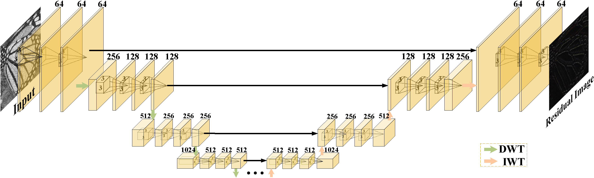
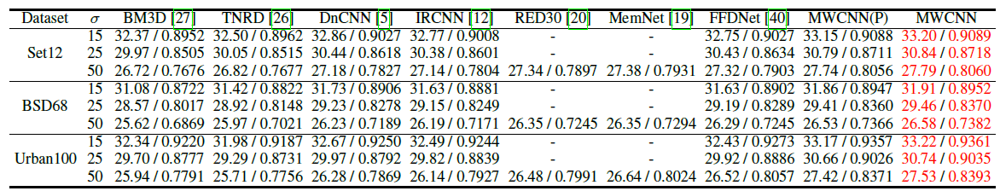
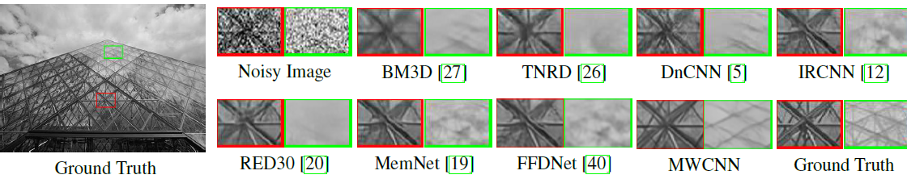
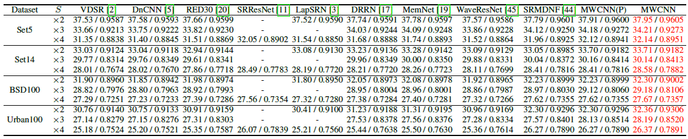
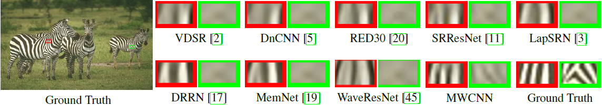
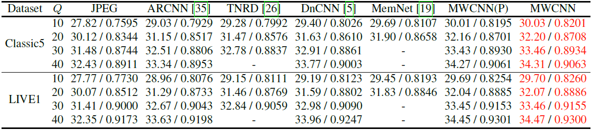
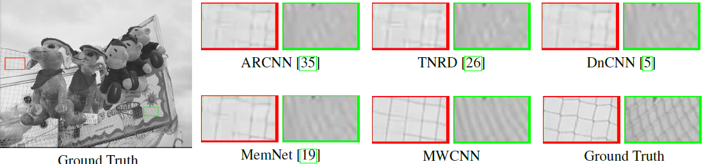

## Multi-level Wavelet Convolutional Neural Networks

## Abstract
 In computer vision, convolutional networks (CNNs) often adopts pooling to enlarge receptive field which has the advantage of low computational complexity. However, pooling can cause information loss and thus is detrimental to further operations such as features extraction and analysis. Recently, dilated filter has been proposed to trade off between receptive field size and efficiency. But the accompanying gridding effect can cause a sparse sampling of input images with checkerboard patterns. To address this problem, in this paper, we propose a novel multi-level wavelet CNN (MWCNN) model to achieve better trade-off between receptive field size and computational efficiency. The core idea is to embed wavelet transform into CNN architecture to reduce the resolution of feature maps while at the same time, increasing receptive field. Specifically, MWCNN for image restoration is based on U-Net architecture, and inverse wavelet transform (IWT) is deployed to reconstruct the high resolution (HR) feature maps. The proposed MWCNN can also be viewed as an improvement of dilated filter and a generalization of average pooling, and can be applied to not only image restoration tasks, but also any CNNs requiring a pooling operation. The experimental results demonstrate effectiveness of the proposed MWCNN for tasks such as image denoising,
 
 
<p align="center">
    
    <br />    <small>  </small>
</p>


## Dependencies
* Python 3.5
* PyTorch >= 1.0.0
* numpy
* skimage
* imageio
* matplotlib
* tqdm
* h5py
* scipy 1.0.0

## Train
Data Set: [DIV2K 800 training images](https://data.vision.ee.ethz.ch/cvl/DIV2K/).

* First, using Generating code to generate 'mat' data for training, then modify the path of training data in data.srdata file.
* Second, using the fllowing to start training code:

  * For image denoising
```python
python main.py --model MWCNN --save MWCNN_DeNoising --scale 15 --n_feats 64 --save_results --print_model --patch_size 256 --batch_size 8 --print_every 1000 --lr 1.024e-4 --lr_decay 100 --n_colors 1 --save_models --task_type denoising
```
where scale indicates noise level here.

  * For image SISR
```python
python main.py --model MWCNN --save MWCNN_DeNoising --scale 2 --n_feats 64 --save_results --print_model --patch_size 256 --batch_size 8 --print_every 1000 --lr 1.024e-4 --lr_decay 100 --n_colors 1 --save_models --task_type SISR
```

  * For JPEG image artifacts removals
```python
python main.py --model MWCNN --save MWCNN_DeNoising --scale 10 --n_feats 64 --save_results --print_model --patch_size 256 --batch_size 8 --print_every 1000 --lr 1.024e-4 --lr_decay 100 --n_colors 1 --save_models --task_type JIAR 
```
where scale indicates quality factor here. 

## Test
* Pretraining model can be found [here](https://drive.google.com/drive/folders/1H8XD1MrS1bEGY5RAjPI0IiZVLADh1JRT?usp=sharing).
* Test commond

 * For image denoising
```python
python main.py --model MWCNN --save MWCNN_DeNoising --scale 15 --n_feats 64 --save_results --print_model --n_colors 1 --test_only --resume -1 --pre_train pretrain_model/denoising/ --data_test Set68 --task_type denoising
```
 * For image SISR
```python
python main.py --model MWCNN --save MWCNN_SISR --scale 2 --n_feats 64 --save_results --print_model --n_colors 1 --test_only --resume -1 --pre_train pretrain_model/SISR/ --data_test Set5 --task_type SISR 
```
 * For JPEG image artifacts removals
```python
python main.py --model MWCNN --save MWCNN_DeNoising --scale 10 --n_feats 64 --save_results --print_model --n_colors 1 --test_only --resume -1 --pre_train pretrain_model/JIAR/ --data_test LIVE1 --task_type JIAR
```

## Results

### Image denoising
<p align="center">
    
    <br />    <small>  </small>
</p>
<p align="center">
    
    <br />    <small>  </small>
</p>


### SISR
<p align="center">
    
    <br />    <small>  </small>
</p>
<p align="center">
    
    <br />    <small>  </small>
</p>


### JPEG Image Artifacts Removal
<p align="center">
    
    <br />    <small>  </small>
</p>
<p align="center">
    
    <br />    <small>  </small>
</p>


## Contact
Please send email to lpj008@126.com

## Citation

@article{Liu2019MWCNN,    
  title={Multi-Level Wavelet Convolutional Neural Networks},    
  author={Liu, Pengju and Zhang, Hongzhi and Lian Wei and Zuo, Wangmeng},         
  journal={IEEE Access},     
  volume={7},      
  pages={74973-74985},     
  year={2019},    
  publisher={IEEE}    
}


@InProceedings{Liu_2018_CVPR_Workshops,                                                                        
  author = {Liu, Pengju and Zhang, Hongzhi and Zhang, Kai and Lin, Liang and Zuo, Wangmeng},       
  title = {Multi-Level Wavelet-CNN for Image Restoration},                 
  booktitle = {The IEEE Conference on Computer Vision and Pattern Recognition (CVPR) Workshops},          
  month = {June},    
  year = {2018}                     
}


## Acknowledgements
This code is built on [EDSR (PyTorch)](https://github.com/thstkdgus35/EDSR-PyTorch). We thank the authors for sharing their codes of [EDSR Torch  version](https://github.com/LimBee/NTIRE2017) and [PyTorch version](https://github.com/thstkdgus35/EDSR-PyTorch).
